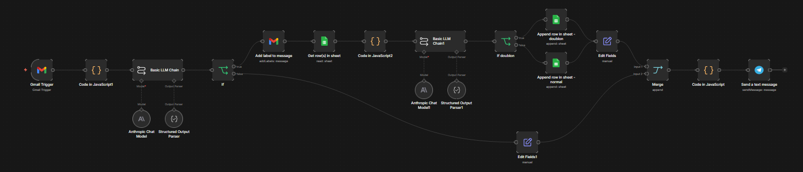

# gmail-automation

> **Side project — be.gate25**
> Automated Gmail triage for a freelance Java developer — n8n · Claude Haiku · Google Sheets · Telegram

---

## What it does

Twice a day, this workflow scans unread Gmail messages and classifies each one as a job opportunity or noise, using Claude Haiku as the reasoning engine.

Detected opportunities are labelled in Gmail, deduplicated against a 7-day history, logged to a Google Sheet, and summarised in a Telegram notification.

---

## Flow



```
Gmail (unread)
      │
      ▼
 Time-window guard
 (cancel if outside scheduled slot)
      │
      ▼
 LLM Call 1 — Classification
 Claude Haiku · structured JSON output
 { est_jd, score, raison }
      │
      ├─── est_jd = false OR score < 5 ──────────────────┐
      │                                                  │
      ▼                                                  │
 Label email in Gmail (JD label)                         │
      │                                                  │
      ▼                                                  │
 Read JD_Tracker sheet (last 7 days)                     │
      │                                                  │
      ▼                                                  │
 LLM Call 2 — Duplicate detection                        │
 Claude Haiku · structured JSON output                   │
 { doublon, ref_id, confiance }                          │
      │                                                  │
      ├─ doublon = true ──▶ Append row (flagged)         │
      └─ doublon = false ─▶ Append row (new)             │
                │                                        │
                └────────────────────────────────────────┘
                                    │
                                    ▼
                             Merge + JS count
                             { total, jds_detectees }
                                    │
                                    ▼
                          Telegram notification
```

---

## Schedule

The Gmail trigger polls at **06:12** and **18:12** every day.

A JavaScript time-window guard runs immediately after: if the execution falls outside the 5–20 minute window around either scheduled time, it throws and cancels the run. This prevents spurious executions if n8n retries or the trigger fires unexpectedly.

---

## LLM calls

### Call 1 — Classification

Classifies the email as a professional Java/backend opportunity for a Belgian senior freelance developer.

| Score | Category | `est_jd` |
|-------|----------|----------|
| 8–10  | Freelance mission (day rate, fixed term, via recruiter) | `true` |
| 5–7   | Permanent contract (CDI/CDD, direct employer) | `true` |
| 1–4   | Irrelevant (wrong stack, outside Belgium, spam) | `false` |

Input: subject, sender address, email body.
Output: `{ est_jd: boolean, score: 1–10, raison: string }` — raw JSON, no markdown.

Only emails with `est_jd = true` AND `score >= 5` proceed to the JD branch.

### Call 2 — Duplicate detection

Compares the current email against the JDs logged in the last 7 days.

Input: current subject + body, array of recent JD rows from the sheet.
Output: `{ doublon: boolean, ref_id: "Mail-ID or null", confiance: 0–1 }` — raw JSON, no markdown.

This catches the common pattern where the same position is forwarded by several recruiters on the same day.

---

## Google Sheet — `JD_Tracker`

Sheet: **JD-DATA**

| Column | Content |
|--------|---------|
| Mail-ID | Gmail message ID (unique key) |
| Date | Reception date |
| Expéditeur | Sender address |
| Sujet | Email subject |
| Score | Classification score (1–10) |
| Raison | Claude's short explanation |
| Statut | `normal` or `doublon` |
| Ref_ID | Mail-ID of the similar JD (if doublon) |
| Body | Email body (truncated) |

---

## Tech stack

| Component | Role |
|-----------|------|
| n8n | Workflow orchestration |
| Gmail OAuth2 trigger | Email polling + label management |
| Claude Haiku 4.5 (`claude-haiku-4-5-20251001`) | Classification + duplicate detection |
| n8n Structured Output Parser | Enforces JSON schema on LLM responses |
| Google Sheets (service account) | JD tracking log |
| Telegram | End-of-run summary notification |
| JavaScript (n8n Code nodes) | Time-window guard, duplicate context prep, result aggregation |

---

## Design notes

**Why two LLM calls instead of one?**
Classification and duplicate detection are independent concerns with different inputs. Combining them into a single prompt would require passing the full sheet history on every email, including irrelevant ones — wasteful and harder to maintain.

**Why Claude Haiku?**
Both tasks are straightforward extraction and comparison on short texts. Haiku's latency and cost profile are well-suited for a twice-daily batch that may process dozens of emails per run.

**Why a time-window guard?**
n8n's polling trigger can fire outside its schedule after a restart or a missed execution. The guard ensures the workflow only runs when intentionally scheduled, avoiding duplicate processing of the same inbox state.

**Structured Output Parser**
Both LLM calls use n8n's Structured Output Parser with an explicit JSON schema. This enforces the response contract and prevents downstream nodes from receiving malformed output.