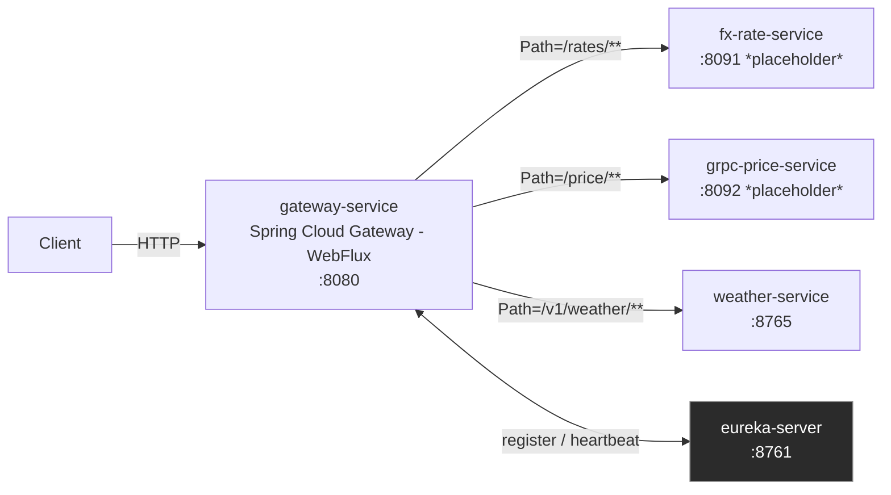

# gateway (eureka-server + gateway-service)

> **Portfolio project #5 — Gateway + Eureka**
> Spring Cloud Gateway (WebFlux) · Eureka Server · Java 25 · Spring Boot 4.1.0 · Spring Cloud 2025.1.2

---

## Status

⚠️ **Work in progress.** This README documents the architecture and current skeleton.
Several items are deliberately not done yet — see [Known limitations](#known-limitations--todo) below.

- [x] Architecture README
- [x] Maven skeleton — `eureka-server` + `gateway-service` (`be.gate25`)
- [x] `EurekaServerApplication` (`@EnableEurekaServer`)
- [x] `GatewayServiceApplication` + property-based routes (static URIs)
- [x] Context-load smoke tests (both modules)
- [ ] `eureka-client` added to `fx-rate-service`, `grpc-price-service`, `weather-service`
- [ ] Routes switched from static URIs to `lb://SERVICE-ID` (service discovery)
- [ ] Port collision resolved (`fx-rate-service` / `grpc-price-service` both default to `8080`)
- [ ] Docker Compose wiring `eureka-server` + `gateway-service` together
- [ ] Circuit breaker (Resilience4j) — optional
- [ ] Rate limiting on the Gateway — optional
- [ ] Config Server — optional, not currently planned

---

## What this is for

The first four "domain" projects in this portfolio (`fx-rate-service`, `grpc-price-service`,
`weather-service`, `elasticsearch-formation-search`) each expose their own REST API on their
own port, with no shared entry point. This project adds the piece that turns a handful of
independent services into something that behaves like a *system*:

- **`eureka-server`** — a service registry. Services that register here announce
  "I'm `fx-rate-service`, reachable at this host:port" and can be looked up by name instead
  of a hardcoded address.
- **`gateway-service`** — a single HTTP entry point that forwards incoming requests to the
  right downstream service based on the request path, instead of clients needing to know
  every service's individual host and port.

---

## Architecture



**Today**, the arrows from `gateway-service` to the three downstream services are **static
URIs** (fixed host:port), not service-discovery lookups — see
[Known limitations](#known-limitations--todo). The arrow to `eureka-server` is real: the
gateway registers itself on startup regardless of how its routes are resolved.

---

## Why Eureka *and* a Gateway (not just one)

A natural question in interview: aren't these two solving the same problem?

- **Eureka** answers *"where is service X right now?"* — it's a directory, nothing more.
  It doesn't touch traffic; a client (or the gateway) still has to ask Eureka and then call
  the service directly.
- **The Gateway** answers *"give clients one single address to talk to"* — it's the thing
  clients actually call. Internally, it can resolve "where is service X" either from a
  hardcoded config (what this skeleton does today) or by asking Eureka (`lb://SERVICE-ID`,
  the target state here).

They're complementary: Eureka removes hardcoded addresses from the system *internally*;
the Gateway removes the need for external clients to know about individual services *at all*.
A gateway without discovery still works (static routes, like today) — it just doesn't
survive a service's host/port changing without a manual edit.

---

## Why WebFlux (not WebMVC) for this module

Decided after comparing both — full breakdown in the project's "pour les nuls" file. Short
version: a gateway is almost pure I/O relay (proxy network calls, negligible CPU work),
which is the textbook case where WebFlux's non-blocking model pays off — a blocked-on-network
thread in WebMVC does nothing useful while it waits, whereas WebFlux frees that thread to
serve another request in the meantime. The rest of this portfolio is intentionally WebMVC/
servlet (`fx-rate-service`, `grpc-price-service`, `weather-service`, `trade-settlement-batch`),
so this module is a deliberate, isolated diversification — not an inconsistency.

---

## Module structure

```
gateway/
├── eureka-server/
│   ├── docker/
│   │   └── Dockerfile
│   ├── src/
│   │   ├── main/
│   │   │   ├── java/be/gate25/eureka/
│   │   │   │   └── EurekaServerApplication.java
│   │   │   └── resources/
│   │   │       └── application.properties
│   │   └── test/java/be/gate25/eureka/
│   │       └── EurekaServerApplicationTests.java
│   └── pom.xml
└── gateway-service/
    ├── docker/
    │   └── Dockerfile
    ├── src/
    │   ├── main/
    │   │   ├── java/be/gate25/gateway/
    │   │   │   └── GatewayServiceApplication.java
    │   │   └── resources/
    │   │       └── application.properties
    │   └── test/java/be/gate25/gateway/
    │       └── GatewayServiceApplicationTests.java
    └── pom.xml
```

---

## Tech stack

| Layer | Tech |
|---|---|
| Language | Java 25 |
| Framework | Spring Boot 4.1.0, Spring Cloud 2025.1.2 ("Oakwood") |
| Gateway | Spring Cloud Gateway — WebFlux variant (`spring-cloud-gateway-server-webflux`) |
| Discovery | Netflix Eureka (`spring-cloud-starter-netflix-eureka-server` / `-client`) |
| Build | Maven |

This is the portfolio's first Boot 4 / Java 25 module — see
`docs/boot4-java25-migration-notes.md` at the repo root for the generic migration checklist
and real-world gotchas (per-JDK-install certificates, Docker image drift, explicit Mockito
agent declaration) collected while setting it up.

---

## Routes (`gateway-service`)

Defined in `application.properties` under the
`spring.cloud.gateway.server.webflux.routes[n]` namespace (the property prefix changed in
Spring Cloud 2025.1.x alongside the webflux/webmvc starter split).

| Route ID | Path predicate | Target (today — static) |
|---|---|---|
| `fx-rate-service` | `/rates/**` | `http://localhost:8091` *(placeholder — pick a real port)* |
| `grpc-price-service` | `/price/**` | `http://localhost:8092` *(placeholder — pick a real port)* |
| `weather-service` | `/v1/weather/**` | `http://localhost:8765` |

---

## Known limitations / TODO

Documented explicitly rather than glossed over, since this is the state of an
in-progress project, not a finished one:

1. **Routes are static, not discovery-based.** `fx-rate-service`, `grpc-price-service` and
   `weather-service` don't yet depend on `spring-cloud-starter-netflix-eureka-client` and
   aren't registered anywhere. The gateway registers itself with `eureka-server`, but its
   routing table doesn't use that registry yet. Switching a route from
   `uri=http://localhost:PORT` to `uri=lb://SERVICE-ID` is a one-line change *per service*,
   once that service can register.

2. **Port collision, unresolved.** As currently documented, `fx-rate-service` and
   `grpc-price-service` both default to `server.port=8080`. They cannot run side by side
   under their current defaults — `8091`/`8092` in the route table above are placeholders
   until real ports are assigned (via `application-gateway.properties`, an env var, or
   updating each service's default).

3. **No integration test layer yet.** Both modules currently only have a Layer 1
   context-load smoke test (`@SpringBootTest`, no Docker). Unlike the Redis/PostgreSQL/
   Elasticsearch projects in this portfolio, there's no obvious drop-in Testcontainers
   image for "a running Eureka registry + a routed HTTP call" — a proper Layer 2 here would
   most likely mean spinning up `eureka-server` itself in the test (via
   `@SpringBootTest(webEnvironment = RANDOM_PORT)`) plus a stub downstream service (e.g.
   WireMock) to assert the gateway actually proxies correctly. Not built yet.

4. **`spring-boot-starter-web-test`** (test scope, `eureka-server`) — not 100% confirmed as
   the correct artifact name for this Boot 4.1 module; verify via start.spring.io
   (add "Eureka Server" + "Testing") before relying on it.

---

## Running locally

No Docker needed for local development — same two-layer philosophy as the rest of the
portfolio (dev machine tests behaviour, homelab tests infrastructure).

```bash
# 1 — Start the registry first
cd eureka-server
./mvnw spring-boot:run
# Eureka dashboard: http://localhost:8761

# 2 — Start the gateway (registers with Eureka on startup)
cd ../gateway-service
./mvnw spring-boot:run

# 3 — Downstream services, once port conflicts are resolved and they're running:
curl http://localhost:8080/rates/EUR-USD          # -> proxied to fx-rate-service
curl http://localhost:8080/price/BEL20:UCB        # -> proxied to grpc-price-service
curl http://localhost:8080/v1/weather/human       # -> proxied to weather-service
```

---

## Tests

```bash
# Both modules — Layer 1 only for now (see Known limitations, point 3)
cd eureka-server && mvn test
cd ../gateway-service && mvn test
```

---

## Deploy (Docker, on the homelab server)

Same build/transfer pattern as every other project in this portfolio: JAR built on the
Windows dev machine, transferred via SCP/SMB, single-stage runtime image on the homelab.

```bash
# 1 — Build both JARs (from each module's directory, on the dev machine)
cd eureka-server && ./mvnw clean package -DskipTests
cd ../gateway-service && ./mvnw clean package -DskipTests

# 2 — Transfer to the homelab
scp eureka-server/target/eureka-server-*.jar     user@homelab:/opt/wkspace-k8s/gateway/eureka-server/
scp gateway-service/target/gateway-service-*.jar user@homelab:/opt/wkspace-k8s/gateway/gateway-service/

# 3 — docker compose up on the homelab (compose file not yet written — see Known limitations)
```

---

## Commit conventions

This project uses [Conventional Commits](https://www.conventionalcommits.org/):
`feat:`, `fix:`, `test:`, `docs:`, `chore:`, `refactor:`
