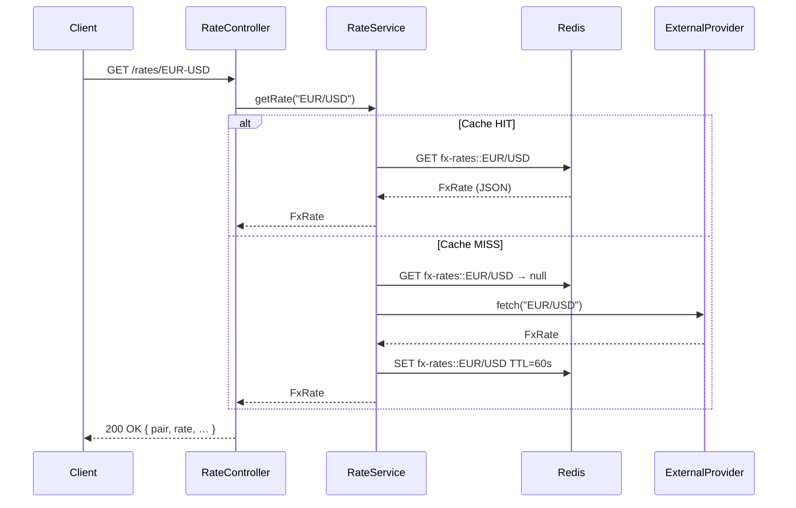
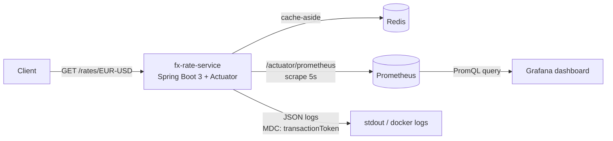
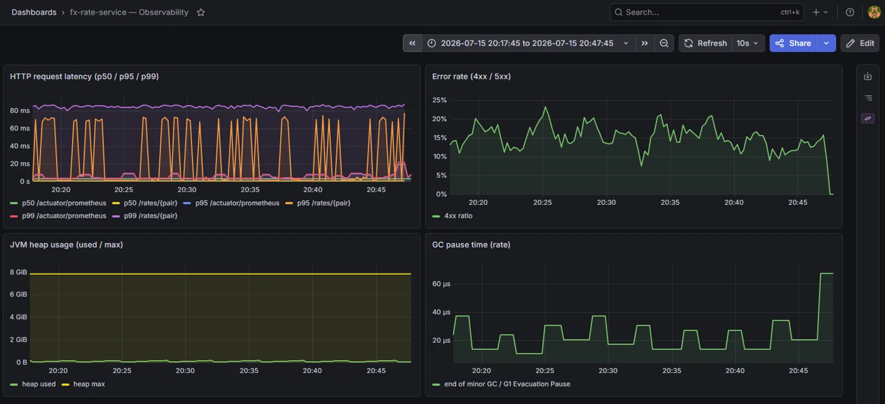
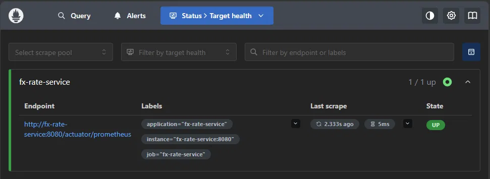
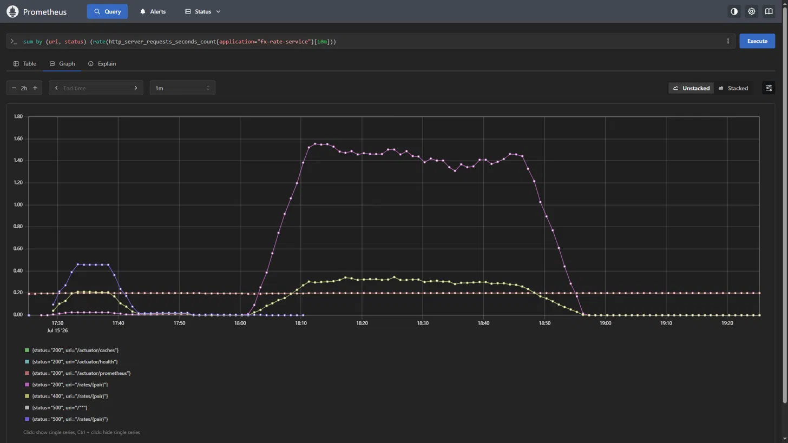

# fx-rate-service

> **Portfolio project #8 — Redis Caching**
> Spring Boot 3 · Java 21 · Spring Cache · Redis · Testcontainers · Prometheus · Grafana

---

## What it does

`fx-rate-service` exposes a small REST API that returns live FX rates (EUR/USD, EUR/GBP, …).
Rates are fetched from a (stubbed) external provider and **cached in Redis** to avoid redundant
remote calls. A cache miss triggers the provider; subsequent calls within the TTL are served
directly from Redis.

This service is a building block for the **Kafka Financial Pipeline** (#1) where the same
cache-aside pattern will be used to hold reference data consumed by stream processors.

---

## Architecture



### Component overview

```
fx-rate-service
├── FxRateApplication          @SpringBootApplication + @EnableCaching
│
├── config/
│   └── CacheConfig            RedisCacheManager — per-cache TTL via RedisCacheConfiguration
│
├── domain/
│   └── FxRate                 record (pair, rate, baseCurrency, quoteCurrency, fetchedAt)
│
├── provider/
│   ├── ExternalRateProvider   interface (production: ECB / Bloomberg / Refinitiv)
│   └── StubExternalRateProvider  simulates latency + tracks call count for tests
│
├── service/
│   └── RateService            @Cacheable / @CacheEvict — cache-aside logic
│
└── controller/
    └── RateController         REST: GET /rates/{pair}  DELETE /rates/{pair}  DELETE /rates
```

---

## Cache configuration

| Cache name      | TTL   | Purpose                       |
|-----------------|-------|-------------------------------|
| `fx-rates`      | 60 s  | Live FX mid-prices            |
| `fx-rates-meta` | 300 s | Static pair metadata (future) |

TTLs are configurable in `application.properties`:

```properties
fx-rate.cache.ttl-seconds.fx-rates=60
fx-rate.cache.ttl-seconds.fx-rates-meta=300
```

Values are serialized as **JSON** (Jackson) — human-readable in `redis-cli`, and robust across
application restarts. The serializer registers `JavaTimeModule` (for `java.time.Instant`) and
a `BasicPolymorphicTypeValidator` restricted to `be.gate25.fxrate.domain`, `java.math` and
`java.time` — enough to round-trip `FxRate` correctly without the unrestricted polymorphic
typing that makes `GenericJackson2JsonRedisSerializer` a known deserialization risk when left
wide open.

---

## API

| Method   | Path            | Description                  |
|----------|-----------------|------------------------------|
| `GET`    | `/rates`        | List supported pairs         |
| `GET`    | `/rates/{pair}` | Get rate (cached or fresh)   |
| `DELETE` | `/rates/{pair}` | Evict single pair from cache |
| `DELETE` | `/rates`        | Evict all pairs (EOD reset)  |

Path pairs use `-` as separator: `/rates/EUR-USD` → `EUR/USD`.

### Example

```bash
# First call — cache miss (≈80 ms simulated latency)
curl http://localhost:8080/rates/EUR-USD

# Second call — cache hit (< 5 ms)
curl http://localhost:8080/rates/EUR-USD

# Force refresh
curl -X DELETE http://localhost:8080/rates/EUR-USD
curl http://localhost:8080/rates/EUR-USD   # miss again

# Inspect cache in Redis
redis-cli keys "fx-rates*"
redis-cli ttl  "fx-rates::EUR/USD"
redis-cli get  "fx-rates::EUR/USD"
```

---

## Running locally

**Prerequisites:** Docker, Java 21, Maven.

```bash
# 1 — Redis only (app runs from IDE / Maven)
docker compose up redis -d

# 2 — Run the app
./mvnw spring-boot:run

# 3 — Full stack
docker compose up --build
```

---

## Tests

The testing strategy is organized in two complementary layers, following a simple principle:
**test behaviour locally, test infrastructure in CI**.

### Why two layers?

A cache has two distinct aspects to validate:

1. **Behaviour** — does `@Cacheable` actually prevent redundant provider calls? does `@CacheEvict` invalidate the right entry? This behaviour is independent of the underlying cache
   implementation.

2. **Redis infrastructure** — does the JSON serialization survive a round-trip? is the TTL applied server-side? That requires a real Redis instance.

Separating the two lets every developer run `mvn test` with zero infrastructure, while CI still validates the real Redis integration.

### Layer 1 — `RateServiceCacheTest` (local, no Docker required)

```bash
mvn test
```

Active profile `test` → **Caffeine** in-memory cache (`application-test.yml`). Same Spring Cache abstraction, zero infrastructure. Assertions rely on the call counter in
`StubExternalRateProvider`.

| Scenario          | Assertion                                           |
|-------------------|-----------------------------------------------------|
| First call        | Provider invoked once (cache miss)                  |
| Second call       | Provider NOT invoked again (cache hit)              |
| Key normalisation | `EUR/USD` and `eur/usd` map to the same cache entry |
| Single eviction   | Miss on the evicted pair, hit on the others         |
| `evictAll()`      | All pairs become misses                             |
| Unknown pair      | `UnsupportedPairException`, no cache pollution      |

### Layer 2 — `RateServiceRedisIT` (CI, Docker required)

```bash
mvn test   # automatically skipped if Docker is absent (@Testcontainers(disabledWithoutDocker = true))
```

**Testcontainers** starts `redis:7.2-alpine` on a random port; Spring connects to it via `@DynamicPropertySource`. The container is created at the start of the test class and
destroyed at the end — the application itself runs in the normal JVM, not inside Docker.

What this layer adds on top of Caffeine:

| Aspect                        | Caffeine | Real Redis |
|-------------------------------|----------|------------|
| Cache-aside behaviour         | ✓        | ✓          |
| JSON serialization round-trip | ✗        | ✓          |
| Server-side TTL               | ✗        | ✓          |
| Real `RedisConnectionFactory` | ✗        | ✓          |

> **Why not `embedded-redis`?**
> The `embedded-redis` libraries ship a native Redis binary compiled for specific architectures.
> They are incompatible with Java 17+ on most modern platforms (Linux ARM, macOS Apple Silicon…).
> Testcontainers with the official image is the idiomatic choice for Spring Boot 3 / Java 21.

> **Update:** Layer 2 now includes `cachedValue_shouldSurviveSerializationRoundTrip`, which
> asserts that a value read back from Redis after a cache write matches the original `FxRate`
> field by field. This closes the gap that let the original `JavaTimeModule` serialization bug
> (see "What this dashboard actually caught" below) pass both test layers undetected — that
> bug would have failed this test immediately, since the write never reached Redis in a
> readable form.

---

## Observability

`fx-rate-service` exposes its metrics in Prometheus format and ships a pre-provisioned
Grafana dashboard, started along with the rest of the stack via Docker Compose.



- The application exposes `/actuator/prometheus` (Prometheus text format, via Micrometer).
- Prometheus scrapes this endpoint every 5 seconds (`docker/prometheus/prometheus.yml`).
- Grafana queries Prometheus and renders a pre-provisioned dashboard at startup
  (no manual re-setup needed on every `docker compose up`).
- Every log line is a JSON object containing the `transactionToken` (MDC, set by
  `transaction-token-starter`), so a slow request seen in Grafana can be correlated with
  its exact log lines.

### Dashboard

The `fx-rate-service — Observability` dashboard has 4 panels:

| Panel                              | Metric                                                            | Why                                                                                                                               |
|------------------------------------|-------------------------------------------------------------------|-----------------------------------------------------------------------------------------------------------------------------------|
| HTTP request latency (p50/p95/p99) | `histogram_quantile()` over `http_server_requests_seconds_bucket` | The average hides spikes - percentiles show the real user experience, notably the difference between a cache hit and a cache miss |
| Error rate (4xx/5xx)               | ratio of `http_server_requests_seconds_count{status=~"4..\|5.."}` | Catch a degradation before a ticket comes in                                                                                      |
| JVM heap usage                     | `jvm_memory_used_bytes` / `jvm_memory_max_bytes`                  | Spot a memory leak or GC pressure before an OOM                                                                                   |
| GC pause time                      | `rate(jvm_gc_pause_seconds_sum[5m])`                              | Complements the heap panel: a JVM can have free memory but excessive GC that degrades latency                                     |



*Live traffic generated with `scripts/generate-fx-traffic.sh`. p95/p99 (orange/pink) spike
regularly above the flat p50 (green) - each spike is a cache miss hitting the external
provider, while p50 stays low on cache hits.*

Prometheus itself is worth showing too, since it's the layer that actually collects
what Grafana displays:



*Status → Targets: confirms Prometheus is successfully scraping
`fx-rate-service:8080/actuator/prometheus` every 5 seconds.*



*`sum by (uri, status) (rate(http_server_requests_seconds_count{application="fx-rate-service"}[1m]))`
— traffic broken down by endpoint and status code. The brief `status="500"` spike on the
left is the Redis serialization bug described below, caught and fixed during this session;
the sustained portion on the right shows healthy traffic once fixed: ~80% `200` on
`/rates/{pair}`, ~20% `400` (the deliberately invalid pairs sent by the traffic script),
no `500`.*

### What this dashboard actually caught

Setting this up wasn't just wiring boxes together - it surfaced a real bug in the
existing `fx-rate-service` code, unrelated to the observability stack itself:
`CacheConfig`'s `GenericJackson2JsonRedisSerializer` had no `JavaTimeModule` registered,
so every cache write silently failed to serialize `FxRate.fetchedAt` (an `Instant`),
raising an exception that propagated all the way to the client as an HTTP 500 - while
the computed rate itself was correct. The Redis cache was effectively a no-op the whole
time. A manual happy-path `curl` never revealed it (a single request looks fine); it was
the flat p50/p95/p99 latency lines and the elevated error-rate panel that gave it away.

Fixing it also surfaced a second, more subtle issue: with `DefaultTyping.NON_FINAL`,
Jackson's default-typing wrapper is asymmetric for `record` types (implicitly `final` in
Java) - writes omit the type envelope at the root, but reads expect it, causing an
intermittent deserialization failure on the *second* read of any given key. Switching to
`DefaultTyping.EVERYTHING` resolved it.

### Why Prometheus/Grafana over ELK (even in a Kubernetes context)

I'm not certain this is THE universal answer - it depends on the client's context - but for
this portfolio project, a few concrete reasons weighed in:

- **Pull vs push model**: Prometheus actively scrapes targets; no need to set up an
  ingestion pipeline (Logstash/Filebeat) for every new service. On Kubernetes, this
  translates to simple scrape annotations or a `ServiceMonitor` (if Prometheus Operator is
  deployed), without an extra agent to maintain per pod.
- **Lightweight for a homelab**: ELK (Elasticsearch + Logstash + Kibana) is noticeably
  heavier on RAM/CPU at rest than Prometheus + Grafana - a practical factor here, not
  just an architectural one.
- **Metrics, not logs**: ELK is primarily a full-text search engine over documents (logs),
  not a time-series engine. For latency percentiles or error rates, Prometheus is the
  native tool; ELK would require re-aggregating logs to simulate what Prometheus does
  natively.
- **Kubernetes ecosystem**: Prometheus is the CNCF de-facto standard for metrics
  (kube-state-metrics, node-exporter, Prometheus Operator) - a banking/EU profile already
  familiar with ELK for application logs will often see Prometheus/Grafana as a complement
  for metrics, not a replacement. ELK remains relevant for full-text log search (already
  covered by my `elasticsearch-formation-search` project).

Worth nuancing in an interview: if the dominant need is searching/analyzing large log
volumes rather than real-time metrics, ELK (or Loki, lighter-weight, within the Grafana
ecosystem) remains a defensible choice. Both stacks often coexist in production.

### Running with observability

```bash
# 1. Build the JAR (from the project root, on the Windows dev machine)
./mvnw clean package -DskipTests

# 2. Transfer the JAR to the homelab (Dockerfile expects it pre-built - no Maven/JDK
#    toolchain runs inside the container, single-stage runtime image only)
scp target/fx-rate-service-*.jar user@homelab:/opt/wkspace-k8s/fx-rate/

# 3. On the homelab - start the whole stack (app + redis + prometheus + grafana)
cd /opt/wkspace-k8s/fx-rate
docker compose up -d --build

# 4. Generate real traffic (mixes valid pairs with a few deliberately invalid ones)
./scripts/generate-fx-traffic.sh localhost:8090 30

# 5. Open Grafana
open http://<homelab-ip>:3000   # admin / <your password> - change the default before any non-homelab use

# 6. Check raw metrics if you need to debug
curl http://localhost:8090/actuator/prometheus | grep http_server_requests
```

### Endpoints

| Endpoint                       | Description                                          |
|--------------------------------|------------------------------------------------------|
| `GET /actuator/health`         | App health (includes Redis connectivity)             |
| `GET /actuator/prometheus`     | Metrics in Prometheus format (scraped automatically) |
| `GET /actuator/metrics/{name}` | A given Micrometer metric, JSON format               |
| `http://<homelab-ip>:9090`     | Prometheus UI (ad hoc PromQL queries)                |
| `http://<homelab-ip>:3000`     | Grafana UI (pre-provisioned dashboard)               |

---

## Relation to the portfolio

| Project                         | Connection                                                       |
|---------------------------------|------------------------------------------------------------------|
| `weather-service` / `q-weather` | Same cache-aside pattern, different domain                       |
| **Kafka Financial Pipeline**    | `fx-rates` cache will serve reference data to stream processors  |
| **PostgreSQL + Flyway**         | Add DB-backed rate history; cache sits in front of the read path |

---

## Conventional Commits used

```
feat: add RateService with @Cacheable and @CacheEvict
feat: configure RedisCacheManager with per-cache TTL
feat: add RateController REST endpoints
test: add RateServiceCacheTest with Caffeine (local, no Docker)
test: add RateServiceRedisIT with Testcontainers (CI, Docker required)
docs: add README with architecture diagram
chore: add Dockerfile and docker-compose
feat: add Actuator + Micrometer, expose /actuator/prometheus
chore: add Prometheus + Grafana to docker-compose, provisioned dashboard
fix: register JavaTimeModule for Redis cache serialization (Instant support)
fix: switch DefaultTyping to EVERYTHING for correct record type-wrapping
docs: add observability section with dashboard screenshots
```