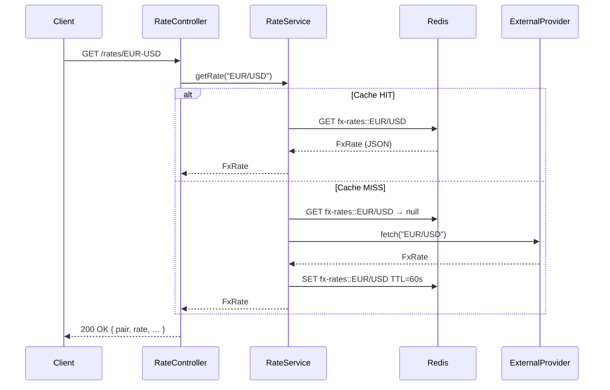

# fx-rate-service

> **Portfolio project #8 — Redis Caching**
> Spring Boot 3 · Java 21 · Spring Cache · Redis · Testcontainers

---

## What it does

`fx-rate-service` exposes a small REST API that returns live FX rates (EUR/USD, EUR/GBP, …).
Rates are fetched from a (stubbed) external provider and **cached in Redis** to avoid redundant
remote calls.  A cache miss triggers the provider; subsequent calls within the TTL are served
directly from Redis.

This service is a building block for the **Kafka Financial Pipeline** (#1) where the same
cache-aside pattern will be used to hold reference data consumed by stream processors.

---

## Architecture



### Component overview

```
fx-rate-service
├── FxRateApplication          @SpringBootApplication + @EnableCaching
│
├── config/
│   └── CacheConfig            RedisCacheManager — per-cache TTL via RedisCacheConfiguration
│
├── domain/
│   └── FxRate                 record (pair, rate, baseCurrency, quoteCurrency, fetchedAt)
│
├── provider/
│   ├── ExternalRateProvider   interface (production: ECB / Bloomberg / Refinitiv)
│   └── StubExternalRateProvider  simulates latency + tracks call count for tests
│
├── service/
│   └── RateService            @Cacheable / @CacheEvict — cache-aside logic
│
└── controller/
    └── RateController         REST: GET /rates/{pair}  DELETE /rates/{pair}  DELETE /rates
```

---

## Cache configuration

| Cache name      | TTL     | Purpose                        |
|-----------------|---------|--------------------------------|
| `fx-rates`      | 60 s    | Live FX mid-prices             |
| `fx-rates-meta` | 300 s   | Static pair metadata (future)  |

TTLs are configurable in `application.yml`:

```yaml
fx-rate:
  cache:
    ttl-seconds:
      fx-rates: 60
      fx-rates-meta: 300
```

Values are serialized as **JSON** (Jackson) — human-readable in `redis-cli`, and robust across
application restarts.

---

## API

| Method   | Path               | Description                     |
|----------|--------------------|---------------------------------|
| `GET`    | `/rates`           | List supported pairs            |
| `GET`    | `/rates/{pair}`    | Get rate (cached or fresh)      |
| `DELETE` | `/rates/{pair}`    | Evict single pair from cache    |
| `DELETE` | `/rates`           | Evict all pairs (EOD reset)     |

Path pairs use `-` as separator: `/rates/EUR-USD` → `EUR/USD`.

### Example

```bash
# First call — cache miss (≈80 ms simulated latency)
curl http://localhost:8080/rates/EUR-USD

# Second call — cache hit (< 5 ms)
curl http://localhost:8080/rates/EUR-USD

# Force refresh
curl -X DELETE http://localhost:8080/rates/EUR-USD
curl http://localhost:8080/rates/EUR-USD   # miss again

# Inspect cache in Redis
redis-cli keys "fx-rates*"
redis-cli ttl  "fx-rates::EUR/USD"
redis-cli get  "fx-rates::EUR/USD"
```

---

## Running locally

**Prerequisites:** Docker, Java 21, Maven.

```bash
# 1 — Redis only (app runs from IDE / Maven)
docker compose up redis -d

# 2 — Run the app
./mvnw spring-boot:run

# 3 — Full stack
docker compose up --build
```

---

## Tests

The testing strategy is organized in two complementary layers, following a simple principle:
**test behaviour locally, test infrastructure in CI**.

### Why two layers?

A cache has two distinct aspects to validate:

1. **Behaviour** — does `@Cacheable` actually prevent redundant provider calls? does `@CacheEvict` invalidate the right entry? This behaviour is independent of the underlying cache implementation.

2. **Redis infrastructure** — does the JSON serialization survive a round-trip? is the TTL applied server-side? That requires a real Redis instance.

Separating the two lets every developer run `mvn test` with zero infrastructure, while CI still validates the real Redis integration.

### Layer 1 — `RateServiceCacheTest` (local, no Docker required)

```bash
mvn test
```

Active profile `test` → **Caffeine** in-memory cache (`application-test.yml`). Same Spring Cache abstraction, zero infrastructure. Assertions rely on the call counter in `StubExternalRateProvider`.

| Scenario | Assertion |
|---|---|
| First call | Provider invoked once (cache miss) |
| Second call | Provider NOT invoked again (cache hit) |
| Key normalisation | `EUR/USD` and `eur/usd` map to the same cache entry |
| Single eviction | Miss on the evicted pair, hit on the others |
| `evictAll()` | All pairs become misses |
| Unknown pair | `UnsupportedPairException`, no cache pollution |

### Layer 2 — `RateServiceRedisIT` (CI, Docker required)

```bash
mvn test   # automatically skipped if Docker is absent (@Testcontainers(disabledWithoutDocker = true))
```

**Testcontainers** starts `redis:7.2-alpine` on a random port; Spring connects to it via `@DynamicPropertySource`. The container is created at the start of the test class and destroyed at the end — the application itself runs in the normal JVM, not inside Docker.

What this layer adds on top of Caffeine:

| Aspect | Caffeine | Real Redis |
|---|---|---|
| Cache-aside behaviour | ✓ | ✓ |
| JSON serialization round-trip | ✗ | ✓ |
| Server-side TTL | ✗ | ✓ |
| Real `RedisConnectionFactory` | ✗ | ✓ |

> **Why not `embedded-redis`?**
> The `embedded-redis` libraries ship a native Redis binary compiled for specific architectures.
> They are incompatible with Java 17+ on most modern platforms (Linux ARM, macOS Apple Silicon…).
> Testcontainers with the official image is the idiomatic choice for Spring Boot 3 / Java 21.

---

## Observability

Spring Boot Actuator endpoints:

```
GET /actuator/health        → Redis connectivity check
GET /actuator/caches        → list active caches
GET /actuator/metrics/cache.gets?tag=name:fx-rates   → hit / miss counters
```

---

## Relation to the portfolio

| Project | Connection |
|---|---|
| `weather-service` / `q-weather` | Same cache-aside pattern, different domain |
| **#1 Kafka Financial Pipeline** | `fx-rates` cache will serve reference data to stream processors |
| **#4 PostgreSQL + Flyway**      | Add DB-backed rate history; cache sits in front of the read path |

---

## Conventional Commits used

```
feat: add RateService with @Cacheable and @CacheEvict
feat: configure RedisCacheManager with per-cache TTL
feat: add RateController REST endpoints
test: add RateServiceCacheTest with Caffeine (local, no Docker)
test: add RateServiceRedisIT with Testcontainers (CI, Docker required)
docs: add README with architecture diagram
chore: add Dockerfile and docker-compose
```
